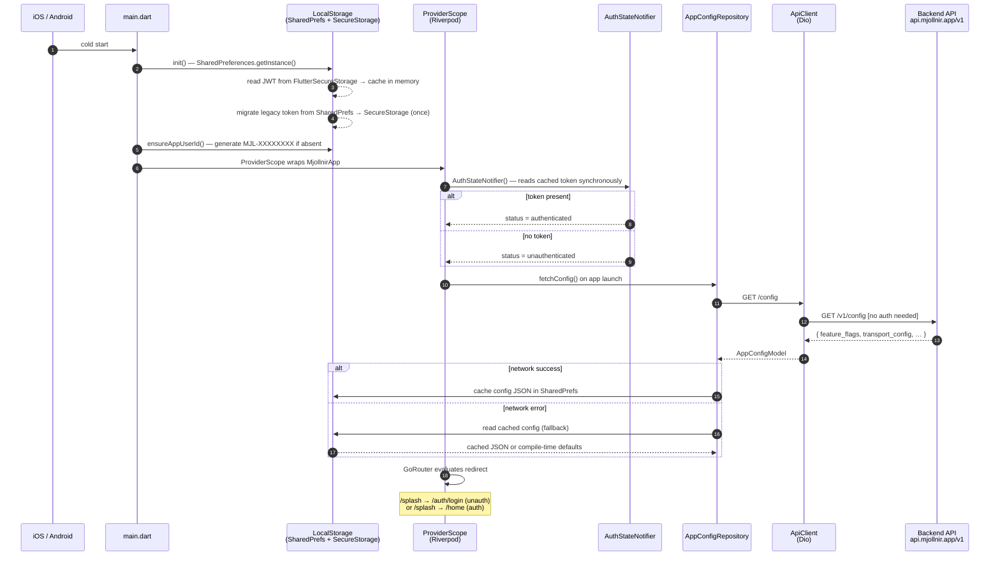
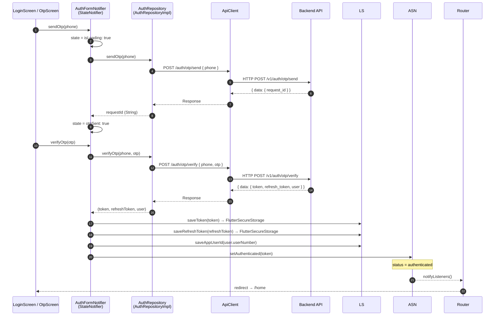
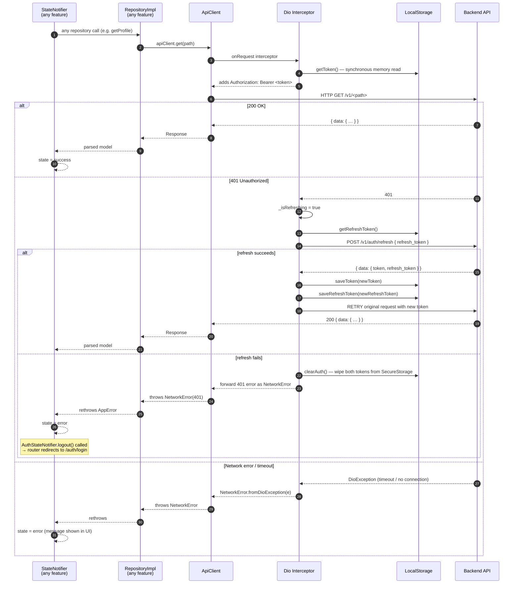
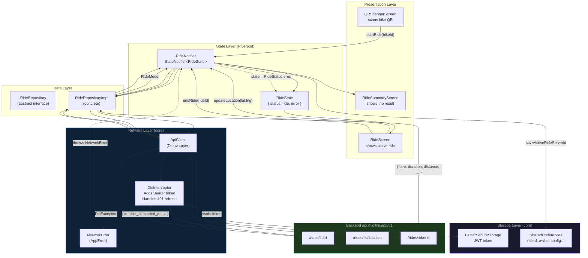
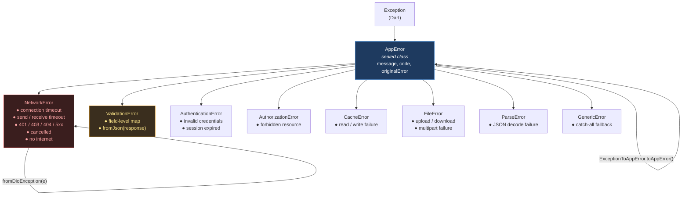
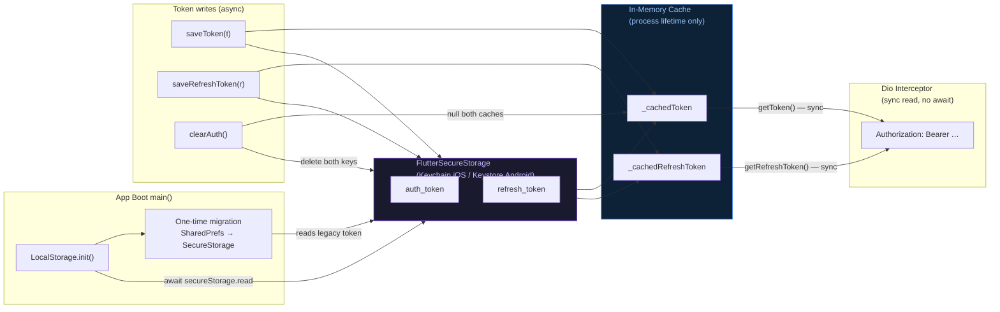
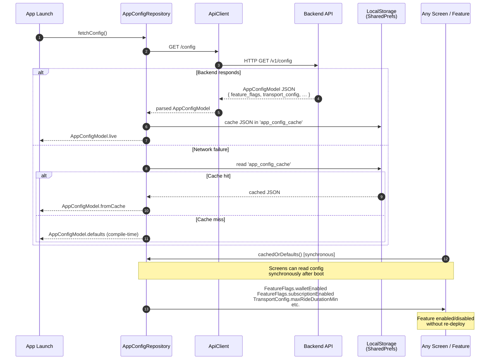
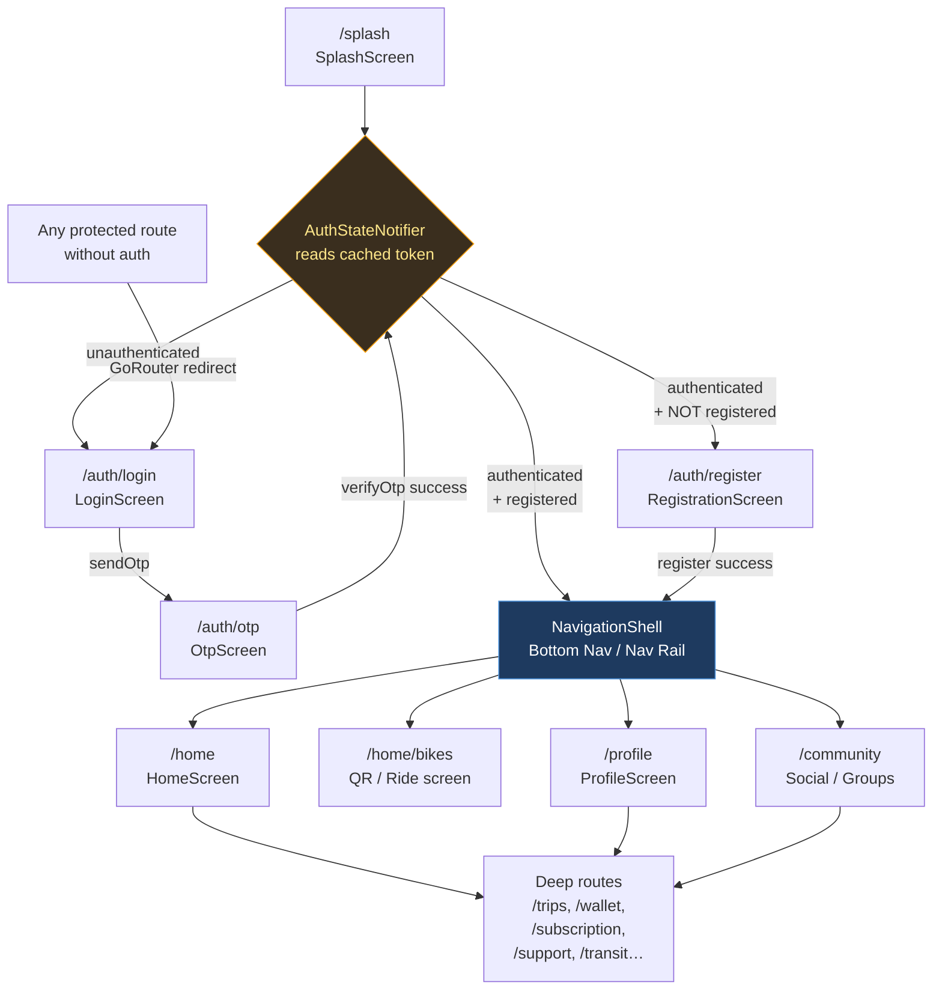
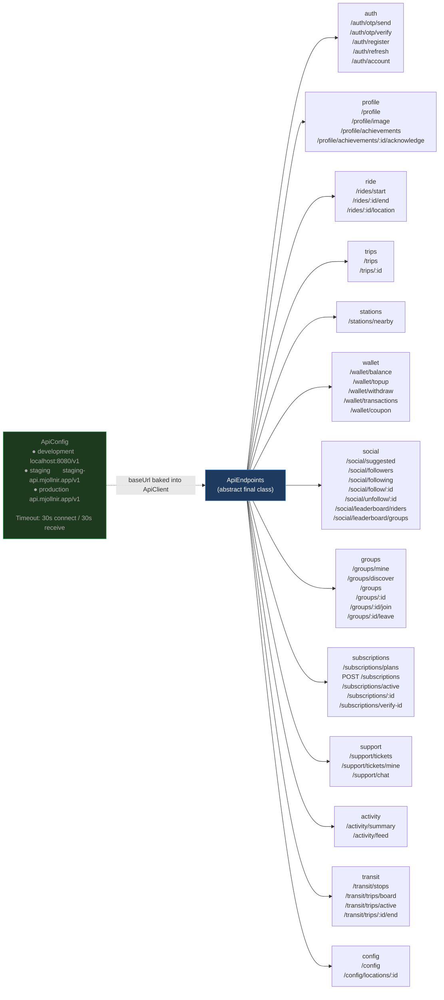

# Mjollnir App — API Flow Diagrams

> All diagrams use [Mermaid](https://mermaid.js.org/) syntax.  
> Render in VS Code with the **Markdown Preview Mermaid Support** extension,  
> or paste into [mermaid.live](https://mermaid.live).

---

## 1. App Boot & Initialisation Sequence

---

## 2. Authentication Flow (OTP Login)

---

## 3. Authenticated Request Lifecycle (with Token Auto-Refresh)

---

## 4. Dependency Injection Architecture

```mermaid
graph TD
    subgraph CORE["core/network/"]
        ACP["apiClientProvider<br/><i>Provider&lt;ApiClient&gt;</i><br/>● Singleton<br/>● Dio under the hood<br/>● Auth interceptor baked in"]
    end

    subgraph FEATURE_REPOS["Feature Repository Providers"]
        AUTH["authRepositoryProvider"]
        PROFILE["profileRepositoryProvider"]
        RIDE["rideRepositoryProvider"]
        HOME["homeRepositoryProvider"]
        TRIPS["tripRepositoryProvider"]
        WALLET["walletRepositoryProvider"]
        SOCIAL["socialRepositoryProvider"]
        GROUPS["groupRepositoryProvider"]
        SUB["subscriptionRepositoryProvider"]
        ACT["activityRepositoryProvider"]
        SUP["supportRepositoryProvider"]
        TRANSIT["transitRepositoryProvider<br/><i>(via screen provider)</i>"]
    end

    subgraph FEATURE_STATE["Feature State Notifiers"]
        AUTH_N["AuthFormNotifier"]
        AUTH_S["AuthStateNotifier"]
        PROFILE_N["ProfileNotifier"]
        RIDE_N["RideNotifier"]
        HOME_N["HomeNotifier"]
        TRIPS_N["TripsNotifier"]
        WALLET_N["WalletNotifier"]
        SOCIAL_N["SocialNotifier"]
        GROUPS_N["GroupsNotifier"]
        SUB_N["SubscriptionNotifier"]
        ACT_N["ActivityNotifier"]
        SUP_N["SupportNotifier"]
    end

    ACP --> AUTH
    ACP --> PROFILE
    ACP --> RIDE
    ACP --> HOME
    ACP --> TRIPS
    ACP --> WALLET
    ACP --> SOCIAL
    ACP --> GROUPS
    ACP --> SUB
    ACP --> ACT
    ACP --> SUP
    ACP --> TRANSIT

    AUTH    --> AUTH_N
    PROFILE --> PROFILE_N
    RIDE    --> RIDE_N
    HOME    --> HOME_N
    TRIPS   --> TRIPS_N
    WALLET  --> WALLET_N
    SOCIAL  --> SOCIAL_N
    GROUPS  --> GROUPS_N
    SUB     --> SUB_N
    ACT     --> ACT_N
    SUP     --> SUP_N

    style ACP fill:#1e3a5f,color:#fff,stroke:#4a90d9
    style CORE fill:#0d2137,color:#aaa,stroke:#4a90d9
```

---

## 5. Full Request Data Flow (Single Feature — Ride Example)

---

## 6. Error Handling Hierarchy

---

## 7. Token Security & Storage Flow

---

## 8. Remote Config & Feature Flags Flow

---

## 9. Navigation & Route Guard Flow

---

## 10. API Endpoint Registry Structure

