# Mjollnir App — App Flow Documentation

> Screen-by-screen user journeys, navigation trees, and state transitions.  
> All diagrams use [Mermaid](https://mermaid.js.org/) syntax.  
> Render in VS Code with the **Markdown Preview Mermaid Support** extension,  
> or paste into [mermaid.live](https://mermaid.live).

---

## Table of Contents

1. [High-Level Navigation Map](#1-high-level-navigation-map)
2. [App Startup & Auth Guard](#2-app-startup--auth-guard)
3. [Authentication Flow](#3-authentication-flow)
4. [Main Shell Navigation](#4-main-shell-navigation)
5. [Home & Station Flow](#5-home--station-flow)
6. [Ride Flow (Shared Bike)](#6-ride-flow-shared-bike)
7. [Ride Flow (Own Bike — Record Mode)](#7-ride-flow-own-bike--record-mode)
8. [Ride Pricing Logic](#8-ride-pricing-logic)
9. [Trips & History Flow](#9-trips--history-flow)
10. [Wallet Flow](#10-wallet-flow)
11. [Profile & Account Flow](#11-profile--account-flow)
12. [Social & Community Flow](#12-social--community-flow)
13. [Groups Flow](#13-groups-flow)
14. [Activity Feed Flow](#14-activity-feed-flow)
15. [Subscription Flow](#15-subscription-flow)
16. [Transit Flow](#16-transit-flow)
17. [Support Flow](#17-support-flow)
18. [Account Deletion Flow](#18-account-deletion-flow)
19. [Feature Flags & Remote Config](#19-feature-flags--remote-config)
20. [Screen Inventory](#20-screen-inventory)

---

## 1. High-Level Navigation Map

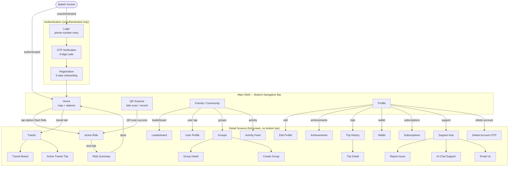

---

## 2. App Startup & Auth Guard

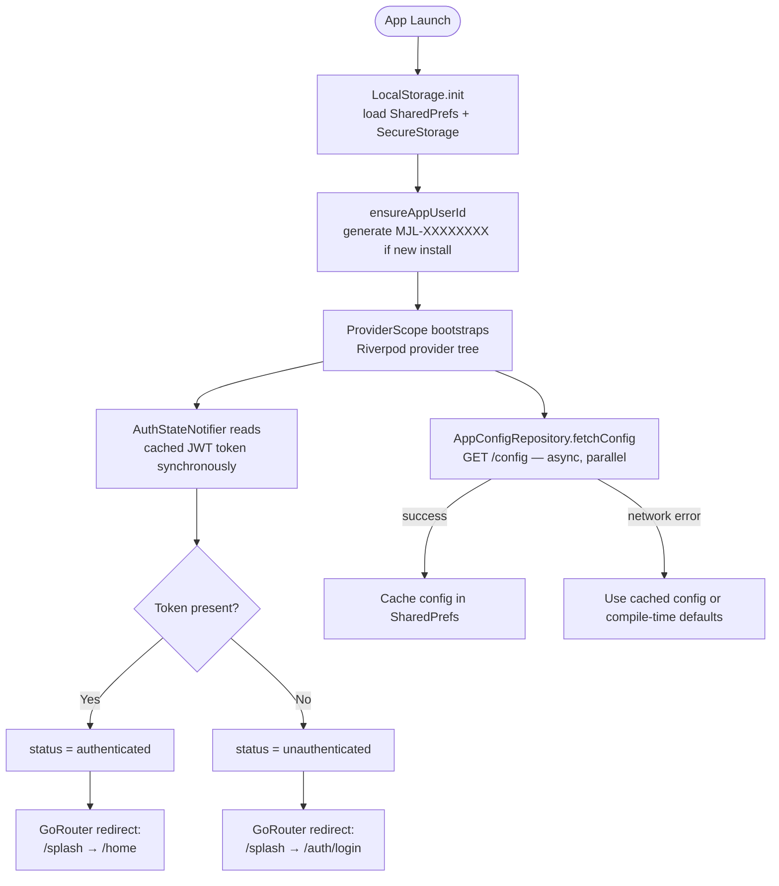

**Auth guard rule (applied on every navigation event):**
- `unauthenticated` + route is not `/auth/*` → redirect to `/auth/login`
- `authenticated` + route is `/auth/*` → redirect to `/home`
- All other routes → pass through

---

## 3. Authentication Flow

### 3.1 Step-by-step screen flow

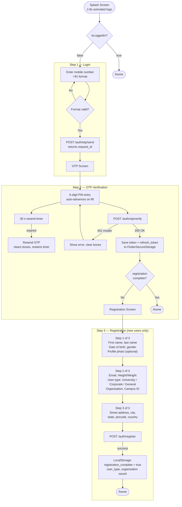

### 3.2 OTP Screen detail

| Element | Behaviour |
|---|---|
| Phone display | Masked: `+91 ××××1234` |
| 6 input boxes | Auto-focus next on digit entry; backspace moves to previous |
| Progress strip | Fills proportionally as digits are entered |
| Resend button | Disabled for 30 s; on tap clears all boxes, calls `/auth/otp/send` again |
| Error state | Boxes shake + turn red; error text appears below |

---

## 4. Main Shell Navigation

The bottom navigation bar is always visible on the four root routes. It is hidden on all detail screens.

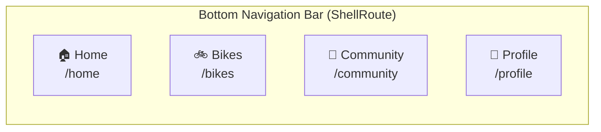

| Tab | Route | Screen | Purpose |
|---|---|---|---|
| Home | `/home` | `HomeScreen` | Map view, station list, start ride |
| Bikes | `/bikes` | `QrScannerScreen` | Scan QR or record personal ride |
| Community | `/community` | `FriendsScreen` | Social feed, leaderboard, groups |
| Profile | `/profile` | `ProfileScreen` | Account details, settings, wallet |

---

## 5. Home & Station Flow

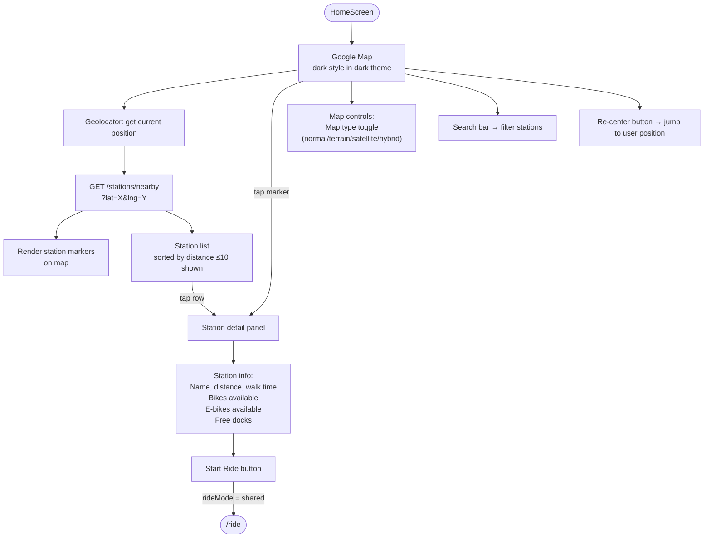

**Station model fields:** `id`, `name`, `distanceMetres`, `walkMinutes`, `bikesAvailable`, `ebikesAvailable`, `availableDocks`, `lat`, `lng`

---

## 6. Ride Flow (Shared Bike)

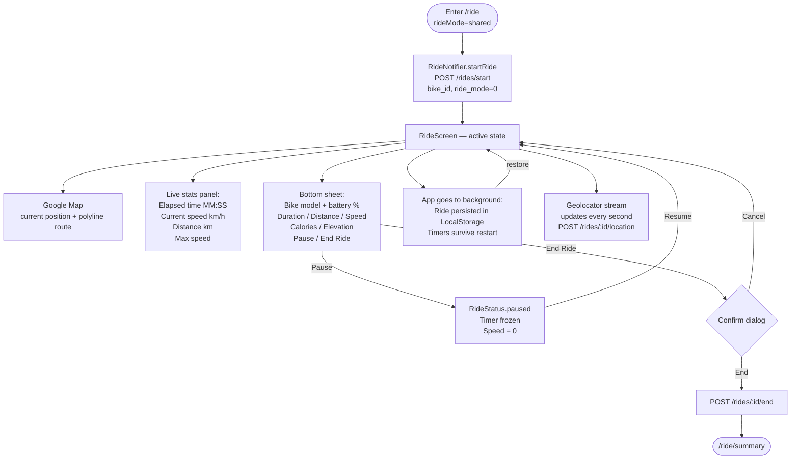

### Ride state machine

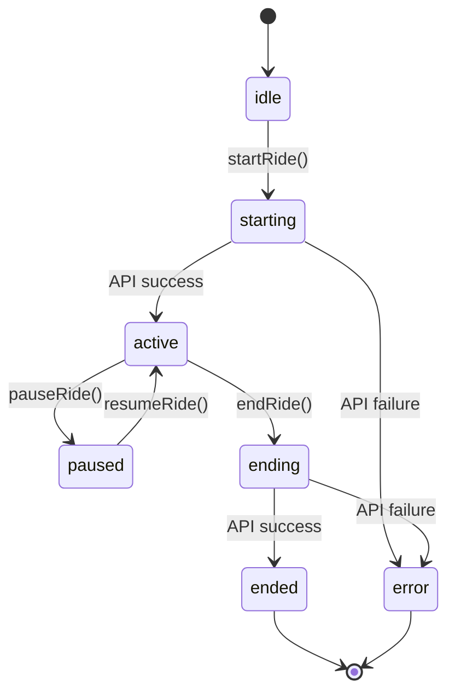

---

## 7. Ride Flow (Own Bike — Record Mode)

```mermaid
flowchart TD
    QR([QrScannerScreen]) --> TAB[Select "Record Ride" tab]
    TAB --> START_REC[RideNotifier.startRide\nPOST /rides/start\nrideMode=1, bikeId=null]
    START_REC --> RIDE_SCR[RideScreen\nSame UI as shared ride]
    RIDE_SCR --> NO_BIKE["Bike info panel:\nshows 'Your Bike'\nbattery % hidden"]
    RIDE_SCR --> END2[End Ride → POST /rides/:id/end]
    END2 --> SUM2([/ride/summary\nNo fare charged for own bike])
```

**Key difference:** `rideMode = 1` — fare calculation is skipped in the summary; only stats and eco metrics are shown.

---

## 8. Ride Pricing Logic

Applies to **shared bike rides** (`rideMode = 0`) only.

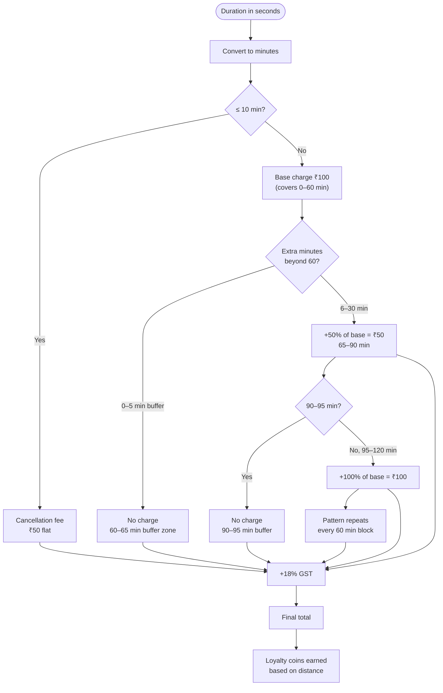

**Ride summary breakdown line items:** Base fare → Extra charges → GST → **Total** → Coins earned

---

## 9. Trips & History Flow

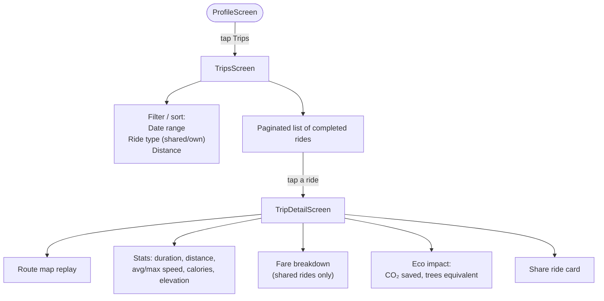

---

## 10. Wallet Flow

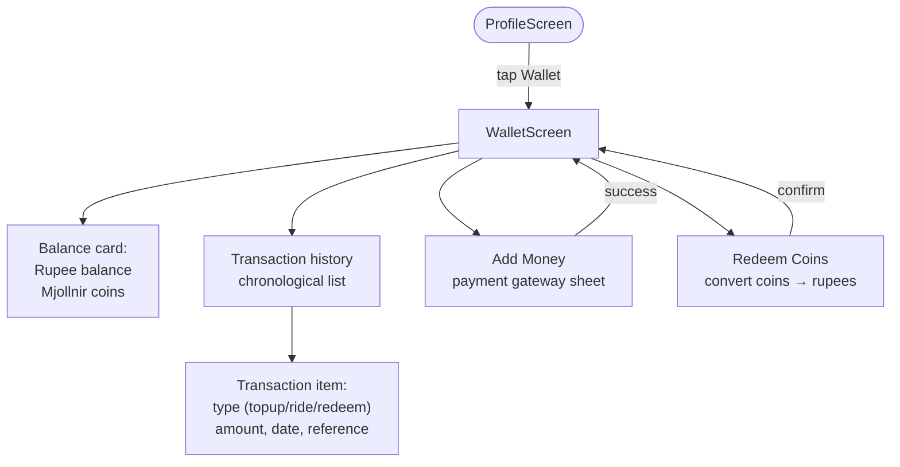

**Coin conversion rate** is set by `AppSettings.coinConversionRate` (from remote config).

---

## 11. Profile & Account Flow

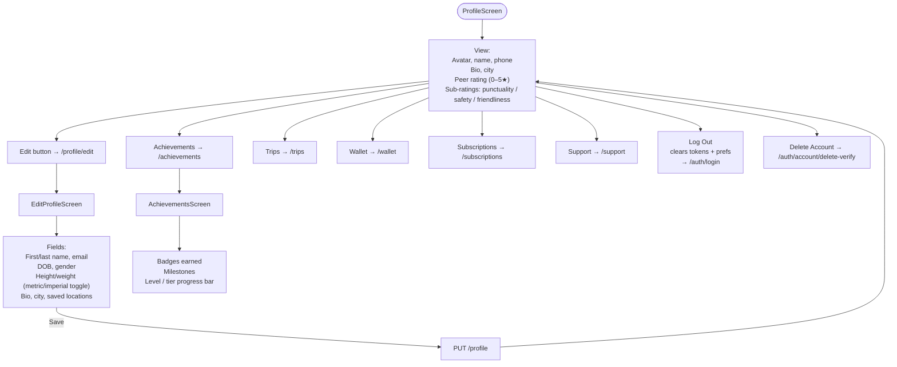

---

## 12. Social & Community Flow

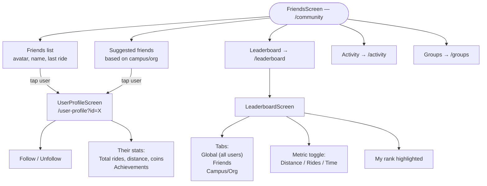

---

## 13. Groups Flow

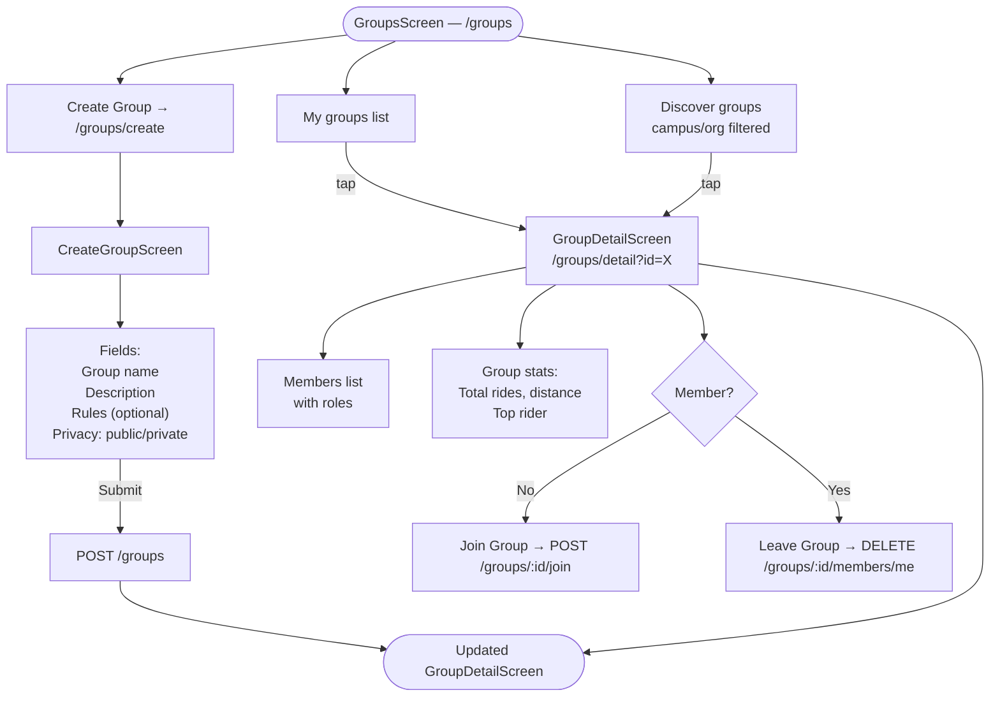

---

## 14. Activity Feed Flow

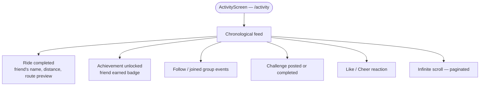

---

## 15. Subscription Flow

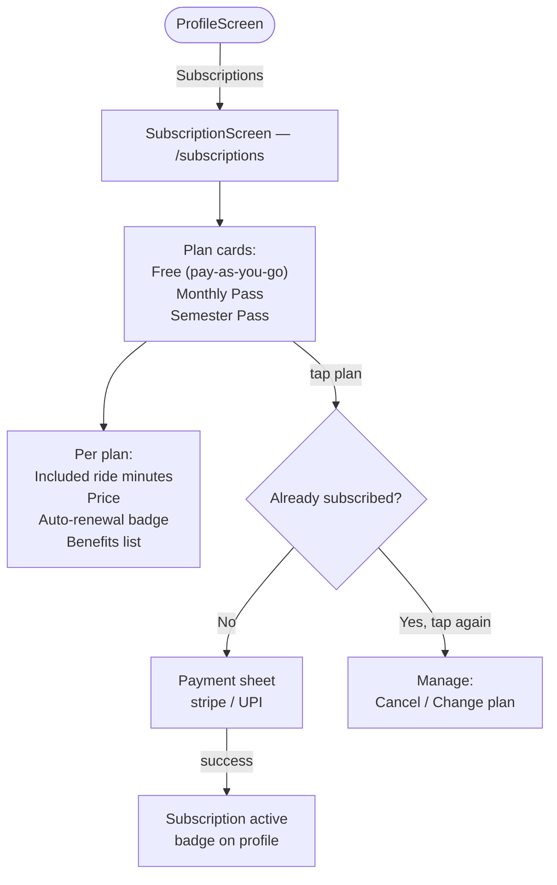

**Vehicle payment model** per `RemoteVehicleConfig`: `subscriptionIncluded`, `payAsYouGo`, or `both`.

---

## 16. Transit Flow

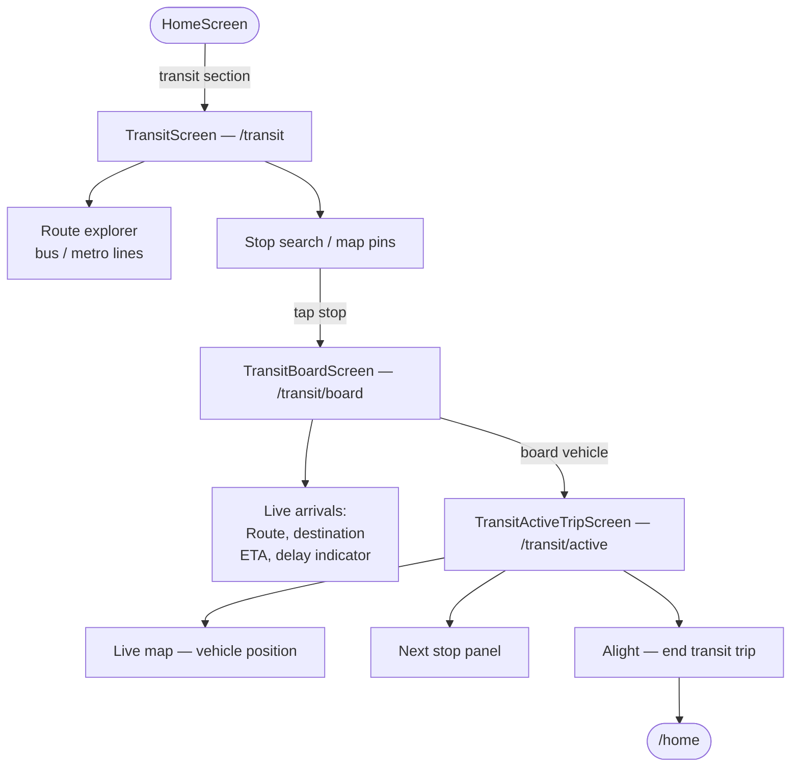

---

## 17. Support Flow

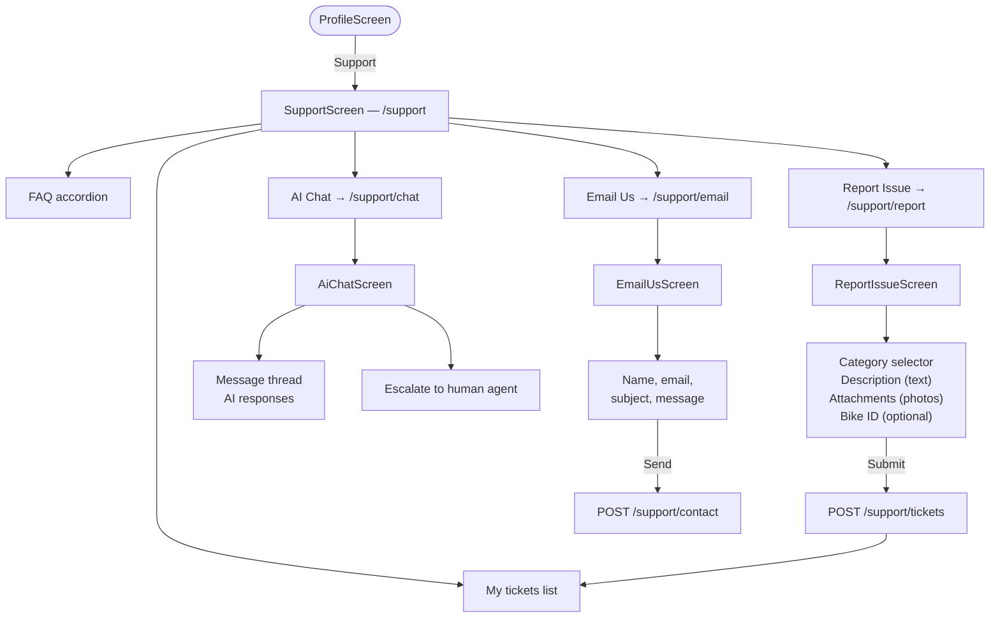

---

## 18. Account Deletion Flow

```mermaid
flowchart TD
    PROFILE5([ProfileScreen]) -->|Delete Account| SEND_OTP[POST /auth/otp/send\nphone on file]
    SEND_OTP --> DEL_OTP_SCR[DeleteAccountOtpScreen\n/auth/account/delete-verify]
    DEL_OTP_SCR --> ENTER_OTP[Enter 6-digit OTP]
    ENTER_OTP --> CONFIRM_DEL{Confirm final dialog}
    CONFIRM_DEL -->|Cancel| PROFILE5
    CONFIRM_DEL -->|Delete| API_DEL[DELETE /auth/account\nbody: { otp }]
    API_DEL -->|success| CLEAR[Clear all tokens\n+ SharedPreferences]
    CLEAR --> LOGIN2([/auth/login])
```

---

## 19. Feature Flags & Remote Config

All features can be toggled server-side via `GET /config`. The app checks flags before rendering each tab or route.

| Flag | Controls |
|---|---|
| `ride` | Start Ride button + QR scanner tab |
| `transit` | Transit tab on Home |
| `wallet` | Wallet entry on Profile |
| `social` | Community tab |
| `groups` | Groups sub-section |
| `subscriptions` | Subscriptions entry on Profile |
| `support` | Support entry on Profile |
| `activity` | Activity feed entry |
| `trips` | Trips entry on Profile |
| `profile` | Edit Profile button |

If a flag is `false`, the corresponding entry point is hidden. Deep-linking to a disabled route redirects to `/home`.

Fallback order: **remote config → SharedPrefs cache → compile-time defaults**.

---

## 20. Screen Inventory

| Screen | Route | File | Auth required |
|---|---|---|---|
| Splash | `/splash` | `splash_screen.dart` | No |
| Login | `/auth/login` | `login_screen.dart` | No |
| OTP Verification | `/auth/otp` | `otp_screen.dart` | No |
| Registration | `/auth/register` | `registration_screen.dart` | No |
| Delete Account OTP | `/auth/account/delete-verify` | `delete_account_otp_screen.dart` | Yes |
| Home | `/home` | `home_screen.dart` | Yes |
| QR Scanner / Bikes | `/bikes` | `qr_scanner_screen.dart` | Yes |
| Friends / Community | `/community` | `friends_screen.dart` | Yes |
| Profile | `/profile` | `profile_screen.dart` | Yes |
| Active Ride | `/ride` | `ride_screen.dart` | Yes |
| Ride Summary | `/ride/summary` | `ride_summary_screen.dart` | Yes |
| Edit Profile | `/profile/edit` | `edit_profile_screen.dart` | Yes |
| Achievements | `/achievements` | `achievements_screen.dart` | Yes |
| Trips | `/trips` | `trips_screen.dart` | Yes |
| Trip Detail | `/trips/detail` | `trip_detail_screen.dart` | Yes |
| Wallet | `/wallet` | `wallet_screen.dart` | Yes |
| Subscriptions | `/subscriptions` | `subscription_screen.dart` | Yes |
| Leaderboard | `/leaderboard` | `leaderboard_screen.dart` | Yes |
| User Profile | `/user-profile` | `user_profile_screen.dart` | Yes |
| Groups | `/groups` | `groups_screen.dart` | Yes |
| Group Detail | `/groups/detail` | `group_detail_screen.dart` | Yes |
| Create Group | `/groups/create` | `create_group_screen.dart` | Yes |
| Activity Feed | `/activity` | `activity_screen.dart` | Yes |
| Support Hub | `/support` | `support_screen.dart` | Yes |
| Report Issue | `/support/report` | `report_issue_screen.dart` | Yes |
| AI Chat | `/support/chat` | `ai_chat_screen.dart` | Yes |
| Email Us | `/support/email` | `email_us_screen.dart` | Yes |
| Transit | `/transit` | `transit_screen.dart` | Yes |
| Transit Board | `/transit/board` | `transit_board_screen.dart` | Yes |
| Active Transit | `/transit/active` | `transit_active_trip_screen.dart` | Yes |

---

*See also:*  
- [api_contract.md](api_contract.md) — full API request/response schemas  
- [api_flow.md](api_flow.md) — API sequence diagrams  
- [developer_guide.md](developer_guide.md) — architecture & conventions
