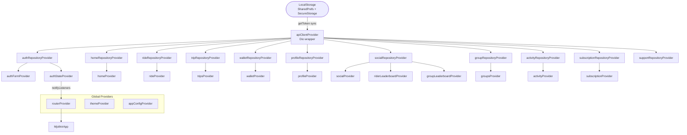
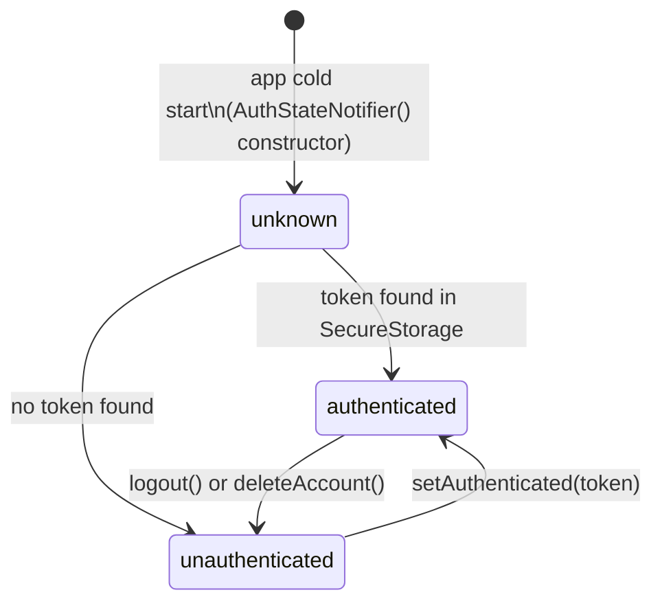
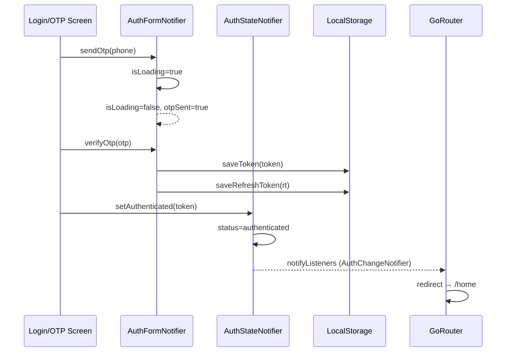
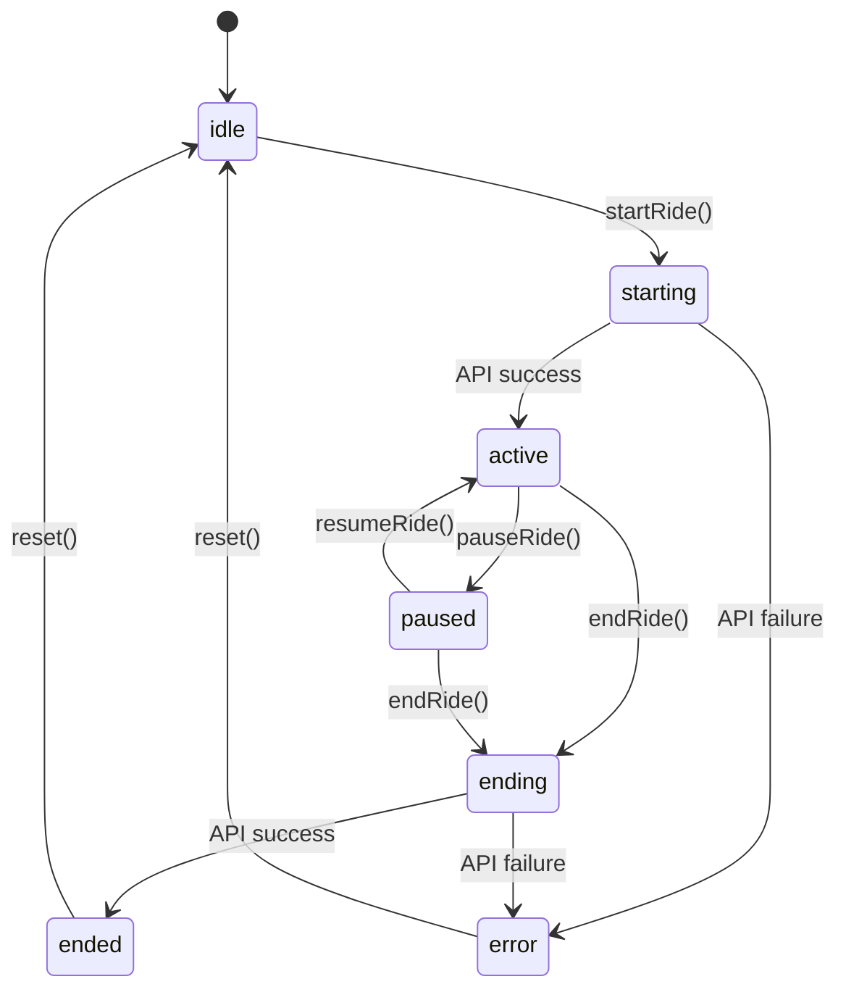
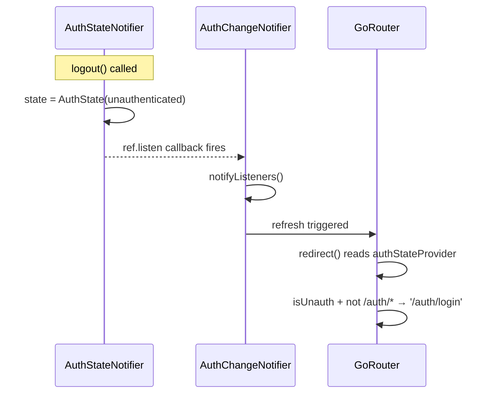
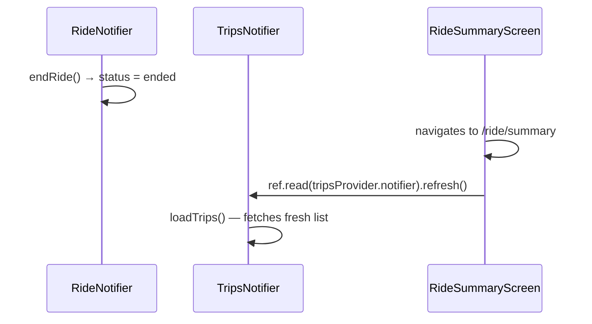
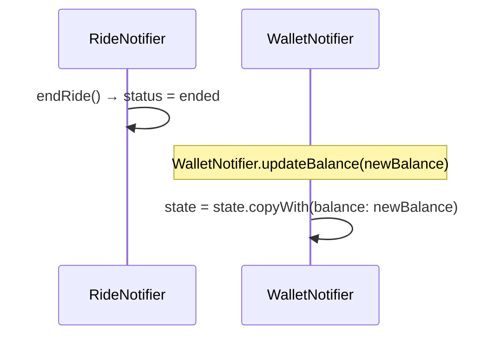
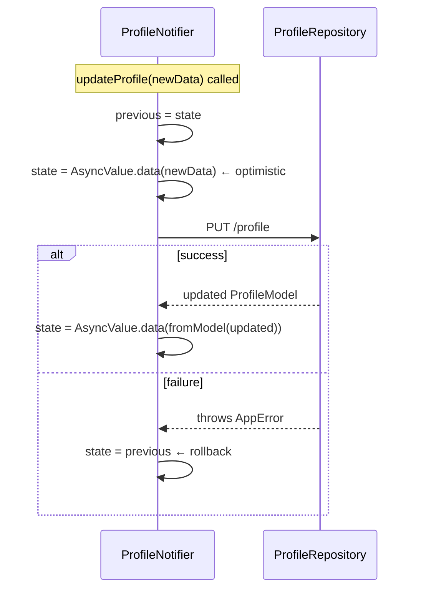
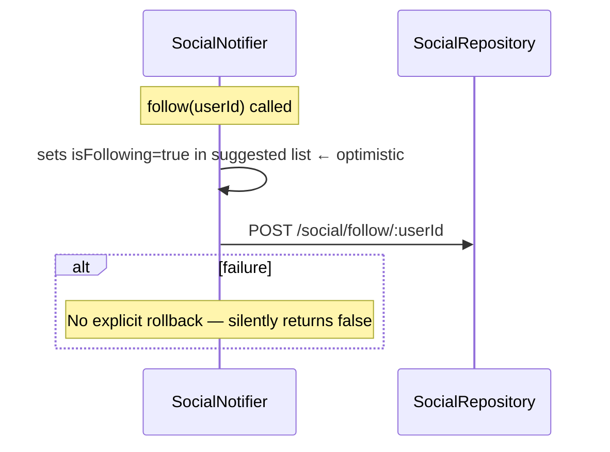

# Mjollnir App — State Flow Documentation

> Complete reference for every Riverpod provider: state shape, transitions, enums, methods, and inter-provider dependencies.

---

## Table of Contents

1. [Provider Architecture Overview](#1-provider-architecture-overview)
2. [Provider Dependency Graph](#2-provider-dependency-graph)
3. [Global Providers](#3-global-providers)
4. [Auth State](#4-auth-state)
5. [Home State](#5-home-state)
6. [Ride State](#6-ride-state)
7. [Trips State](#7-trips-state)
8. [Wallet State](#8-wallet-state)
9. [Profile State](#9-profile-state)
10. [Social State](#10-social-state)
11. [Groups State](#11-groups-state)
12. [Activity State](#12-activity-state)
13. [Subscription State](#13-subscription-state)
14. [Support State](#14-support-state)
15. [Theme State](#15-theme-state)
16. [Remote Config State](#16-remote-config-state)
17. [State Interaction Patterns](#17-state-interaction-patterns)
18. [Provider Quick Reference](#18-provider-quick-reference)

---

## 1. Provider Architecture Overview

All features follow the same three-layer pattern:

```
Repository Provider  ←  apiClientProvider  ←  LocalStorage token (sync)
       ↓
StateNotifier Provider  (owns business logic + async ops)
       ↓
State class  (immutable, copyWith pattern)
       ↓
ref.watch(provider)  →  ConsumerWidget  →  UI rebuild
```

**Provider types in use:**

| Type | Used for | Auto-dispose |
|---|---|---|
| `StateNotifierProvider` | All mutable feature state | No (lives for app lifetime) |
| `StateNotifierProvider<N, AsyncValue<T>>` | Profile (async with loading/error/data) | No |
| `FutureProvider` | Leaderboard lists (read-once) | No |
| `Provider` | Repositories, router, theme, config | No |

**Widget consumption rule:**
- `ref.watch(provider)` → in `build()` — rebuilds widget on state change
- `ref.read(provider.notifier)` → in event handlers — no rebuild

---

## 2. Provider Dependency Graph



---

## 3. Global Providers

### `apiClientProvider`

**File:** `lib/core/network/providers.dart`

```
Provider<ApiClient>
```

Singleton `Dio` wrapper. Created once at app startup and shared by all repository providers. Intercepts every request to attach `Authorization: Bearer <token>` from `LocalStorage.getToken()` (synchronous, memory-cached).

On `401` response → `_tryRefreshToken()` → retries original request → on refresh failure → `LocalStorage.clearAuth()` → `NetworkError(code: "401")` propagates up to the notifier.

---

### `routerProvider`

**File:** `lib/core/router/app_router.dart`

```
Provider<GoRouter>
```

Reads `authStateProvider` inside the `redirect` callback on every navigation event.

**Redirect rules:**

| Auth status | Current route | Redirect to |
|---|---|---|
| `unauthenticated` | not `/auth/*` | `/auth/login` |
| `authenticated` | `/auth/*` | `/home` |
| anything | `/splash` | no redirect (splash handles its own logic) |
| anything | any other | no redirect |

Listens to `authStateProvider` via `AuthChangeNotifier` (a `ChangeNotifier` bridge) — when `AuthStatus` changes, `GoRouter.refresh()` is triggered automatically.

---

### `themeProvider`

**File:** `lib/core/theme/theme_provider.dart`

```
StateNotifierProvider<ThemeNotifier, ThemeMode>
```

Persists the user's theme choice to `LocalStorage`. Read by `MjollnirApp` to set `MaterialApp.router.themeMode`.

---

### `appConfigProvider`

**File:** `lib/core/config/providers.dart`

```
Provider<AppConfigModel>
```

Holds the last-fetched remote config (`GET /config`). Read by subscription screen and feature-flag guards. Falls back to `AppConfigModel.defaults` (all flags enabled) when offline.

**`AppConfigModel` shape:**

| Field | Type | Default |
|---|---|---|
| `features` | `FeatureFlags` | all `true` |
| `locations` | `List<RemoteLocationConfig>` | `[]` |
| `settings` | `AppSettings` | see below |

**`FeatureFlags` fields** (each `bool`, default `true`):
`ride`, `transit`, `wallet`, `social`, `groups`, `subscriptions`, `support`, `activity`, `trips`, `profile`

**`AppSettings` fields:**

| Field | Type | Default |
|---|---|---|
| `coinConversionRate` | `double` | `1.0` |
| `maxRideDurationMin` | `int` | `120` |
| `minWalletBalanceForRide` | `double` | `0.0` |
| `coinsEnabled` | `bool` | `true` |
| `leaderboardEnabled` | `bool` | `true` |
| `supportChatMode` | `String` | `'both'` |
| `maintenanceMessage` | `String?` | `null` |

---

## 4. Auth State

### Providers

| Provider | Type | Purpose |
|---|---|---|
| `authStateProvider` | `StateNotifierProvider<AuthStateNotifier, AuthState>` | Global auth status — watched by router |
| `authFormProvider` | `StateNotifierProvider<AuthFormNotifier, AuthFormState>` | Local form state for login/OTP screens |
| `authRepositoryProvider` | `Provider<AuthRepository>` | |

---

### `AuthState`

```dart
class AuthState {
  final AuthStatus status;          // see enum below
  final String?   token;            // current JWT (null when unauthed)
  final bool      hasCompletedRegistration;
}
```

**`AuthStatus` enum:**



| Value | When set |
|---|---|
| `unknown` | Initial state before `_checkAuth()` completes |
| `authenticated` | Valid JWT found in `LocalStorage` or `setAuthenticated()` called |
| `unauthenticated` | No token, or `logout()` / `deleteAccount()` called |

---

### `AuthStateNotifier` methods

| Method | State transition | Side effects |
|---|---|---|
| `_checkAuth()` (auto, on init) | `unknown` → `authenticated` or `unauthenticated` | Reads `LocalStorage.getToken()` + `registration_complete` |
| `setAuthenticated(token)` | Any → `authenticated` | `LocalStorage.saveToken(token)` |
| `setRegistrationComplete()` | `hasCompletedRegistration` = `true` | `LocalStorage.setBool('registration_complete', true)` |
| `logout()` | Any → `unauthenticated` | `LocalStorage.clearAuth()` + removes `registration_complete` |
| `deleteAccount()` | Any → `unauthenticated` | Calls `logout()` internally |

---

### `AuthFormState`

```dart
class AuthFormState {
  final String  phone;       // entered phone number
  final bool    isLoading;   // waiting for API
  final String? error;       // user-readable error message (null = no error)
  final bool    otpSent;     // whether send-OTP succeeded
}
```

### `AuthFormNotifier` methods

| Method | `isLoading` | On success | On failure |
|---|---|---|---|
| `sendOtp(phone)` | `true` → `false` | `otpSent = true` | `error = e.toString()` |
| `verifyOtp(otp)` | `true` → `false` | Saves token + refreshToken + userId to `LocalStorage` | `error = e.toString()` |
| `register(user)` | `true` → `false` | Saves server userId to `LocalStorage` | `error = e.toString()` |
| `clearError()` | — | `error = null` | — |

---

### Auth flow state sequence



---

## 5. Home State

### `HomeState`

```dart
class HomeState {
  final List<StationModel> stations;         // nearby stations, sorted by distance
  final StationModel?      selectedStation;  // station shown in detail panel (null = panel closed)
  final bool               isLoading;
  final String?            error;
}
```

### `HomeNotifier` methods

| Method | Triggers | State after success | State after failure |
|---|---|---|---|
| `loadStations(lat, lng)` | `GET /stations/nearby?lat&lng` | `stations = result, isLoading = false` | `isLoading = false, error = msg` |
| `selectStation(station)` | None (local) | `selectedStation = station` | — |
| `selectStation(null)` | None (local) | `selectedStation = null` (closes panel) | — |

**Auto-load:** `HomeNotifier` does **not** auto-load on init — `HomeScreen` calls `loadStations()` once it has a GPS fix from `Geolocator`.

---

## 6. Ride State

### `RideState`

```dart
class RideState {
  final RideStatus status;   // see enum below
  final RideModel? ride;     // null until startRide() succeeds
  final String?    error;
}
```

### `RideStatus` enum



| Status | Meaning |
|---|---|
| `idle` | No active ride |
| `starting` | `POST /rides/start` in flight |
| `active` | Ride running; GPS stream firing |
| `paused` | Timer frozen, location updates stopped |
| `ending` | `POST /rides/:id/end` in flight |
| `ended` | API confirmed; navigate to `/ride/summary` |
| `error` | API failed; error message in `state.error` |

---

### `RideNotifier` methods

| Method | Status transition | Side effects |
|---|---|---|
| `startRide(bikeId, rideMode, isEBike)` | `idle` → `starting` → `active` | `LocalStorage.saveActiveRideServerId(id)` |
| `endRide()` | `active/paused` → `ending` → `ended` | Clears active ride from `LocalStorage` |
| `pauseRide()` | `active` → `paused` | Local only — no API call |
| `resumeRide()` | `paused` → `active` | Local only — no API call |
| `updateLocalMetrics(...)` | No status change | Updates `ride.distance`, `speed`, `maxSpeed`, `calories`, `elevation`, `lat`, `lng` in-memory |
| `reset()` | Any → `idle` | Clears `ride` and `error` |

**`rideMode` values:**

| Value | Meaning |
|---|---|
| `0` | Shared bike (fare charged) |
| `1` | Own bike (no fare) |

**Crash recovery:** `ride.id` is written to `LocalStorage.saveActiveRideServerId()` as soon as `startRide()` succeeds. On app restart, `RideScreen` reads this key to rejoin an in-progress ride.

---

### `RideModel` key fields updated during a ride

| Field | Updated by | How |
|---|---|---|
| `seconds` | `RideScreen` timer | Local tick every second |
| `distance` | `updateLocalMetrics(distance:)` | Accumulated from GPS deltas |
| `currentSpeed` | `updateLocalMetrics(speed:)` | From `Geolocator` speed |
| `maxSpeed` | `updateLocalMetrics(speed:)` | `max(speed, current maxSpeed)` |
| `calories` | `updateLocalMetrics(calories:)` | Estimated from distance + weight |
| `elevation` | `updateLocalMetrics(elevation:)` | From altitude delta |
| `lat`, `lng` | `updateLocalMetrics(lat:, lng:)` | Current GPS fix |
| `routePoints` | Appended in `RideScreen` | Each GPS update |

---

## 7. Trips State

### `TripsState`

```dart
class TripsState {
  final List<TripModel> trips;          // full unfiltered list from API
  final String?         activeFilter;   // null = all; 'cycle' | 'bus' | 'buggy' | 'own_bike'
  final bool            isLoading;
  final String?         error;
}
```

**Computed property `filtered`:** Returns `trips` filtered by `activeFilter`. Filtering is client-side — all trips are loaded once.

### `TripsNotifier` methods

| Method | Action |
|---|---|
| `loadTrips()` | `GET /trips?type=<activeFilter>` (null type = all) |
| `refresh()` | Alias for `loadTrips()` — used by pull-to-refresh |
| `setFilter(filter?)` | Updates `activeFilter` then calls `loadTrips()` |

**Auto-load:** `TripsNotifier` calls `loadTrips()` in its constructor — data is available immediately when `TripsScreen` first builds.

---

## 8. Wallet State

### `WalletState`

```dart
class WalletState {
  final double                 balance;         // rupee balance (default 446.0 until API loads)
  final List<TransactionModel> transactions;
  final bool                   isLoading;
  final String?                error;
  final String?                couponMessage;   // feedback after applyCoupon()
  final bool                   couponSuccess;   // true = credit, false = invalid code
}
```

### `WalletNotifier` methods

| Method | API call | State update |
|---|---|---|
| `loadWallet()` | `GET /wallet/balance` + `GET /wallet/transactions` | `balance`, `transactions`, `isLoading` |
| `addMoney(amount)` | `POST /wallet/topup` | `balance = newBalance` |
| `withdraw(amount)` | `POST /wallet/withdraw` | `balance = newBalance` |
| `applyCoupon(code)` | `POST /wallet/coupon` | `couponMessage`, `couponSuccess`, then re-calls `loadWallet()` |
| `clearCouponMessage()` | None | Resets `couponMessage = null`, `couponSuccess = false` |
| `updateBalance(balance)` | None | Local update only — used after ride payment |

**Offline fallback:** `balance` is cached via `LocalStorage.saveWalletBalance()` after each successful `getBalance()` call. On network failure, `LocalStorage.getWalletBalance()` is returned.

---

## 9. Profile State

### Provider type: `StateNotifierProvider<ProfileNotifier, AsyncValue<ProfileData>>`

Unlike other features, profile uses `AsyncValue<ProfileData>` (Riverpod's built-in loading/error/data union) instead of a manual `isLoading` flag.

```dart
AsyncValue.loading()         // initial fetch in flight
AsyncValue.data(ProfileData) // data available
AsyncValue.error(e, st)      // fetch failed, no cached data
```

**In widgets:**
```dart
final profile = ref.watch(profileProvider);

profile.when(
  data:    (p)  => ProfileView(p),
  loading: ()   => const ShimmerCard(),
  error:   (e, _) => ErrorView(e.toString()),
);
```

---

### `ProfileData` fields

| Field | Type | Notes |
|---|---|---|
| `id` | `String` | Server UUID |
| `userNumber` | `String` | `MJL-XXXXXXXX` — from `LocalStorage.getAppUserId()` |
| `firstName`, `lastName` | `String` | |
| `email` | `String` | |
| `phone` | `String` | |
| `bio` | `String` | Free-text, up to 200 chars |
| `dob` | `String` | Display string `"14 / 03 / 2000"` |
| `city` | `String` | |
| `gender` | `String` | `'Male'` / `'Female'` / `'Other'` |
| `height` | `String` | cm as string |
| `weight` | `String` | kg as string |
| `rating` | `double` | Peer aggregate 0–5 |
| `totalRatings` | `int` | Count of peer ratings received |
| `punctualityRating` | `double` | |
| `safetyRating` | `double` | |
| `friendlinessRating` | `double` | |
| `profileImagePath` | `String?` | Local file path (just after pick, before upload) |
| `profileImageUrl` | `String?` | CDN URL after upload |

**Computed getters:** `fullName` (`"$firstName $lastName"`), `initials` (`"RS"` from first chars)

---

### `ProfileNotifier` methods

| Method | Strategy | State result |
|---|---|---|
| `_loadCached()` (auto, on init) | Reads `_repository.getCachedProfile()` synchronously | `AsyncValue.data(ProfileData)` immediately if cached |
| `loadProfile()` (auto, on init) | Silent refresh if data exists; shows loading if not | Replaces with server data on success; keeps existing on failure |
| `updateProfile(data)` | Optimistic: update immediately, rollback on error | `data` on success; previous state on failure |
| `uploadProfileImage(file)` | No optimistic; updates `profileImageUrl` on success | Adds CDN url + local path |
| `deleteProfileImage()` | No optimistic; clears image fields on success | Nulls both image fields |
| `update(data)` | Local-only update | Direct `AsyncValue.data(data)` |

---

## 10. Social State

### `SocialState`

```dart
class SocialState {
  final List<FriendModel> suggested;   // follow suggestions (cross-campus users)
  final List<FriendModel> followers;   // users who follow me
  final List<FriendModel> following;   // users I follow
  final bool              isLoading;
  final String?           error;
}
```

**`FriendModel` key fields:** `id`, `name`, `type` (Student/Employee/General), `totalDistance`, `rides`, `isFollowing`

### `SocialNotifier` methods

| Method | API calls | Optimistic update |
|---|---|---|
| `loadSocial()` (auto init) | `GET /social/suggested` + `/followers` + `/following` (parallel) | No |
| `follow(userId)` | `POST /social/follow/:userId` | Yes — sets `isFollowing = true` in `suggested` list immediately |
| `unfollow(userId)` | `POST /social/unfollow/:userId` | Yes — sets `isFollowing = false` in `suggested` list immediately |

**Leaderboard providers:**

| Provider | Type | Data |
|---|---|---|
| `riderLeaderboardProvider` | `FutureProvider<List<LeaderboardEntry>>` | `GET /social/leaderboard/riders` |
| `groupLeaderboardProvider` | `FutureProvider<List<LeaderboardEntry>>` | `GET /social/leaderboard/groups` |

Both are `FutureProvider` — they fire once when first watched, and re-fire on `ref.refresh(riderLeaderboardProvider)`.

**`LeaderboardEntry` fields:** `id`, `name`, `values` (`Map<String, String>` — metric → display string), `isMe`, `badge` (emoji?)

---

## 11. Groups State

### `GroupsState`

```dart
class GroupsState {
  final List<GroupModel> myGroups;    // groups the current user has joined
  final List<GroupModel> discover;    // public groups to browse
  final bool             isLoading;
  final String?          error;
}
```

**`GroupModel` key fields:** `id`, `name`, `description`, `category`, `members`, `totalDistance`, `joined`, `image_url`

### `GroupsNotifier` methods

| Method | API call | Post-action |
|---|---|---|
| `loadGroups()` (auto init) | `GET /groups/mine` + `GET /groups/discover` (parallel) | Replaces both lists |
| `joinGroup(groupId)` | `POST /groups/:id/join` | Re-calls `loadGroups()` to refresh membership |
| `leaveGroup(groupId)` | `POST /groups/:id/leave` | Re-calls `loadGroups()` to refresh membership |

> **Note:** `joinGroup` and `leaveGroup` do a full reload rather than optimistic update — this ensures group member counts and stats are accurate.

---

## 12. Activity State

### `ActivityState`

```dart
class ActivityState {
  final ActivitySummary summary;          // aggregated stats for selected period
  final String          selectedPeriod;   // 'week' | 'month' | '3m' | 'year'
  final bool            isLoading;
  final String?         error;
}
```

**`ActivitySummary` fields:**

| Field | Type |
|---|---|
| `totalTrips` | `int` |
| `totalDistance` | `double` (km) |
| `totalDurationMin` | `int` |
| `totalCalories` | `double` (kcal) |
| `totalCo2` | `double` (kg saved) |
| `avgSpeed` | `double` (km/h) |
| `weeklyData` | `Map<String, dynamic>` — metric name → array |
| `monthlyData` | `Map<String, dynamic>` |

### `ActivityNotifier` methods

| Method | Action |
|---|---|
| `loadSummary()` (auto init) | `GET /activity/summary?period=week` |
| `setPeriod(period)` | Updates `selectedPeriod` then calls `loadSummary()` |

**Activity feed** is loaded directly in `ActivityScreen` via `_repository.getFeed(page: n)` — no provider (paginated, screen-local state).

---

## 13. Subscription State

### `SubscriptionState`

```dart
class SubscriptionState {
  final List<SubscriptionPlan> plans;    // all plans from API
  final UserSubscription?      active;   // current active subscription (null = none)
  final bool                   isLoading;
  final String?                error;
}
```

**`SubscriptionPlan` fields:**

| Field | Type | Notes |
|---|---|---|
| `id` | `String` | |
| `name` | `String` | Display name |
| `price` | `String` | Formatted, e.g. `"₹299/month"` |
| `priceValue` | `double` | Numeric for comparisons |
| `duration` | `String` | Display, e.g. `"30 days"` |
| `durationDays` | `int` | |
| `coins` | `int` | Bonus coins on activation |
| `features` | `List<String>` | Bulleted benefit strings |
| `category` | `String` | `'campus'` / `'corporate'` / `'public'` / `'topup'` |
| `locationName` | `String` | Maps to `TransportRegistry` key |
| `popular` | `bool` | Shows "Popular" badge |
| `includedModes` | `List<String>` | `'bike'` / `'ebike'` / `'buggy'` / `'bus'` |

**`UserSubscription` fields:**

| Field | Type | Notes |
|---|---|---|
| `id` | `String` | |
| `planName` | `String` | |
| `locationName` | `String` | |
| `startDate` | `DateTime` | |
| `endDate` | `DateTime` | |
| `isActive` | `bool` | Server-authoritative |
| `daysRemaining` | `int` | Computed: `endDate.difference(now).inDays` |

### `SubscriptionNotifier` methods

| Method | API call | State after success |
|---|---|---|
| `loadSubscription()` (auto init) | `GET /subscriptions/plans` + `GET /subscriptions/active` | `plans`, `active`, `isLoading = false` |
| `subscribe(planId)` | `POST /subscriptions` | `active = new subscription` |
| `cancel()` | `DELETE /subscriptions/:id` | `active = null` |
| `verifyInstitutionId(org, id)` | `POST /subscriptions/verify-id` | `active = allocated sub` (if verified) |

**Mock repository:** `SubscriptionRepositoryMock` (31+ seeded plans) is the fallback — swap in `subscriptionRepositoryProvider` when the backend is not live.

---

## 14. Support State

Support uses a **repository-only provider** — no `StateNotifier`.

```dart
final supportRepositoryProvider = Provider<SupportRepository>((ref) {
  return SupportRepositoryImpl(ref.watch(apiClientProvider));
});
```

All three support screens (`ReportIssueScreen`, `AiChatScreen`, `EmailUsScreen`) use `StatefulWidget` with local state for form fields and loading booleans. They read `supportRepositoryProvider` via `ref.read()` in submit handlers.

This intentional design keeps transient form state local rather than in a global provider.

---

## 15. Theme State

**File:** `lib/core/theme/theme_provider.dart`

```
StateNotifierProvider<ThemeNotifier, ThemeMode>
```

| State value | Meaning |
|---|---|
| `ThemeMode.system` | Follow OS setting |
| `ThemeMode.light` | Force light theme |
| `ThemeMode.dark` | Force dark theme |

Persisted to `LocalStorage` (`'theme_mode'` key). Restored on cold start.

---

## 16. Remote Config State

**File:** `lib/core/config/providers.dart`

```
Provider<AppConfigModel>
```

Fetched once on app launch by `AppConfigRepositoryImpl.fetchConfig()`. Cached in `SharedPreferences` under key `'app_config_cache'`.

**Fallback order:**
1. Network fetch → `GET /config`
2. SharedPreferences cache (JSON)
3. `AppConfigModel.defaults` (all flags `true`, no locations, default settings)

**`TransportRegistry`** is populated from `AppConfigModel.locations` after the fetch:
```dart
TransportRegistry.applyRemoteConfig(config.locations);
```

This makes location-specific vehicle availability available throughout the app without an additional provider.

---

## 17. State Interaction Patterns

### Pattern 1 — Auth change triggers router redirect



### Pattern 2 — Ride ends, trips list becomes stale



> **Note:** `TripsNotifier` does not auto-listen to `rideProvider`. The `RideSummaryScreen` or the navigation handler must manually call `tripsProvider.notifier.refresh()` after a ride ends.

### Pattern 3 — Wallet balance updated after ride payment



> If the ride screen has the fare deducted server-side, the wallet must be refreshed. Either call `walletProvider.notifier.loadWallet()` from the summary screen, or the server can return the new balance in the ride-end response.

### Pattern 4 — Profile optimistic update with rollback



### Pattern 5 — Social follow with optimistic update



---

## 18. Provider Quick Reference

| Provider | Notifier | State Type | Auto-loads | Key methods |
|---|---|---|---|---|
| `authStateProvider` | `AuthStateNotifier` | `AuthState` | On init | `setAuthenticated`, `logout`, `setRegistrationComplete` |
| `authFormProvider` | `AuthFormNotifier` | `AuthFormState` | No | `sendOtp`, `verifyOtp`, `register`, `clearError` |
| `routerProvider` | — | `GoRouter` | — | — |
| `themeProvider` | `ThemeNotifier` | `ThemeMode` | On init | `setTheme` |
| `appConfigProvider` | — | `AppConfigModel` | On app launch | — |
| `homeProvider` | `HomeNotifier` | `HomeState` | No | `loadStations`, `selectStation` |
| `rideProvider` | `RideNotifier` | `RideState` | No | `startRide`, `endRide`, `pauseRide`, `resumeRide`, `updateLocalMetrics`, `reset` |
| `tripsProvider` | `TripsNotifier` | `TripsState` | On init | `loadTrips`, `refresh`, `setFilter` |
| `walletProvider` | `WalletNotifier` | `WalletState` | On init | `loadWallet`, `addMoney`, `withdraw`, `applyCoupon`, `clearCouponMessage`, `updateBalance` |
| `profileProvider` | `ProfileNotifier` | `AsyncValue<ProfileData>` | On init (cached + API) | `loadProfile`, `updateProfile`, `uploadProfileImage`, `deleteProfileImage`, `update` |
| `socialProvider` | `SocialNotifier` | `SocialState` | On init | `loadSocial`, `follow`, `unfollow` |
| `riderLeaderboardProvider` | — | `AsyncValue<List<LeaderboardEntry>>` | On first watch | `ref.refresh(...)` |
| `groupLeaderboardProvider` | — | `AsyncValue<List<LeaderboardEntry>>` | On first watch | `ref.refresh(...)` |
| `groupsProvider` | `GroupsNotifier` | `GroupsState` | On init | `loadGroups`, `joinGroup`, `leaveGroup` |
| `activityProvider` | `ActivityNotifier` | `ActivityState` | On init | `loadSummary`, `setPeriod` |
| `subscriptionProvider` | `SubscriptionNotifier` | `SubscriptionState` | On init | `loadSubscription`, `subscribe`, `cancel`, `verifyInstitutionId` |
| `supportRepositoryProvider` | — | `SupportRepository` | — | (used directly in screens) |

---

*See also:*
- [developer_guide.md](developer_guide.md) — `StateNotifier` conventions, `ref.watch` vs `ref.read`, `copyWith` rules
- [features.md](features.md) — per-feature data models and API endpoints
- [debug_guide.md](debug_guide.md) — debugging provider state issues
